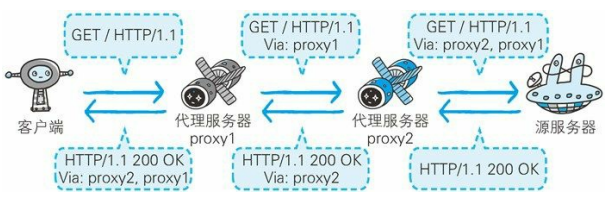
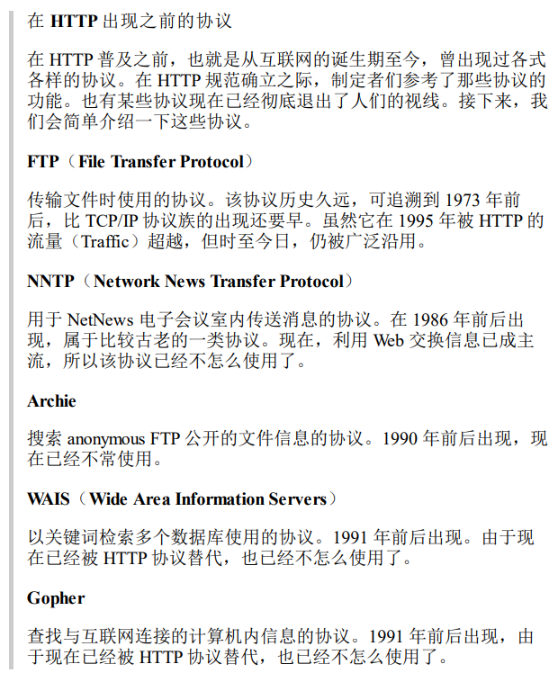

# 与 HTTP 协作的 Web 服务器

## 用单台虚拟主机实现多个域名

HTTP/1.1 规范允许一台 HTTP 服务器搭建多个 Web 站点

比如，提供 Web 托管服务的供应商，可以用一台服务器为多位客户服务，也可以以每位客户持有的域名运行各自不同的网站

这是因为利用了虚拟主机的功能

即使物理层面只有一台服务器，但只要使用虚拟主机的功能，则可以假想已具有多台服务器

客户端大都会采用 www.github.com 这样的主机名和域名访问服务器

在互联网上，域名通过 DNS 服务映射到 IP 地址（域名解析）之后访问目标网站，可见，当请求到服务器时已经是 IP 地址的形式了

如果两个域名不同的网站同时部署在一个服务器上，使用域名解析后，两者的访问 IP 地址会相同

因此在发送 HTTP 请求时，必须在 Host 首部内完整指定主机名或域名的 URI

## 通信数据转发程序：代理、网关、隧道

代理

代理是一种有转发功能的应用程序，他扮演了位于服务器和客户端中间人的角色，接收由客户端发送的请求并转发给服务器，同时也接收服务器返回的响应并转发给客户端

网关

网关是转发其他服务器通信数据的服务器，接收从客户端发送来的请求时，他就像自己拥有资源的源服务器一样，对请求进行处理

有时客户端可能都不会察觉自己的通信目标是一个网关

隧道

隧道是在相隔甚远的客户端和服务器两者之间进行中转，并保持双方通信连接的应用程序

### 代理

代理服务器的基本行为就是接收客户端发送的请求后转发给其他服务器，代理不改变请求 URI，会直接发送给前方持有资源的目标服务器

持有资源实体的服务器被称为源服务器，从源服务器返回的响应经过代理服务器后再传给客户端

在 HTTP 通信过程中，可级联多台代理服务器，请求和响应的转发会经过数台类似锁链一样连接起来的代理服务器

转发时需要附加 Via 首部字段以标记出经过的主机信息

使用代理服务器的理由

- 利用缓存技术减少网络带宽的流量
- 组织内部针对特定网站的访问控制
- 以获取访问日志为主要目的

代理的使用方法

缓存代理

代理转发响应时，缓存代理会预先将资源的副本（缓存）保存在代理服务器上

当代理再次接收到对相同资源的请求时，就将之前缓存的资源作为响应返回

透明代理

转发请求或响应时，不对报文做任何加工的代理类型被称为透明代理

### 网关

网关的工作机制和代理十分相似，而网关能使通信线路上的服务器提供非 HTTP 协议服务

利用玩骨干能够提高通信的安全性，因为可以在客户端与网关置间的通信线路上加密以确保连接的安全

比如，网关可以链接数据库，使用 SQL 语句查询数据，另外，在 Web 购物时，网关可以和信用卡结算系统联动

### 隧道

隧道可按要求建立起一条与其他服务器的通信线路，届时使用 SSL 等加密手段进行通信，隧道的目的是确保客户端能与服务器进行安全的通信

隧道本身不会解析 HTTP 请求，请求会保持原样中转给之后的服务器，隧道会在通信双方断开连接时结束

## 保存资源的缓存

缓存

指代理服务器或客户端本地磁盘内保存的资源副本，利用缓存可减少对源服务器的访问

缓存服务器是代理服务器的一种，并归类在缓存代理类型中

当客户端第二次请求相同资源时，缓存服务器会向源服务器确认缓存资源的有效性，若有效会将被缓存的资源返回给客户端

### 缓存的有效期限

当源服务器的资源更新时，如果缓存服务器还是使用不变的缓存就会返回旧资源

即使缓存服务器存在缓存，也会因为客户端的要求、缓存的有效期等因素向源服务器约人资源的有效性

若判断缓存失效，缓存服务器会再次从源服务器上获取新资源

### 客户端的缓存

前面说到，缓存不仅可以在缓存服务器内，也可以存在于客户端磁盘中，这种被称为临时网络文件

和缓存服务器相同的一点是，当判定缓存过期后，会向源服务器确认资源的有效性，若缓存失效便会再次请求新资源

