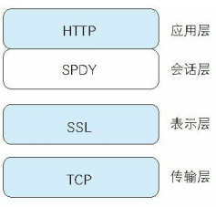
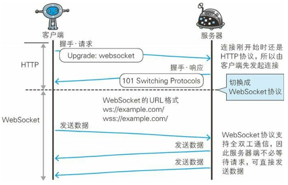

# 基于 HTTP 的功能追加协议

## 基于 HTTP 的协议

### HTTP 的瓶颈

- 一条连接上只可发送一个请求
- 请求只能从客户端开始，客户端不可以接收除响应以外的指令
- 请求 / 响应首部未经压缩就发送，首部信息越多延迟越大
- 发送冗长的首部，每次互相发送相同的首部造成的浪费较多
- 可任意选择数据压缩格式，非强制压缩发送

#### Ajax 的解决方法

Ajax 的核心技术是名为 XMLHttpRequest 的 API

但是本质并未解决 HTTP 协议本身存在的问题

#### Comet 的解决方法

通常，服务器接收到请求，处理完毕后就会立即返回响应，但为了实时推送功能，Comet 会先将响应置于挂起状态，当服务器端有内容更新时再返回该响应

内容上虽然可以做到实时更新，但为了保留响应，一次连接的持续时间也变长了，并且会消耗更多的资源

但是本质并未解决 HTTP 协议本身存在的问题

### SPDY 的设计与功能

SPDY 没有完全改写 HTTP 协议，而是在 TCP/IP 的应用层与传输层置间通过新加会话层的形式运作，同时，考虑到安全性问题，SPDY 规定通信中使用 SSL

SPDY 以会话层的形式加入，控制对数据的流动，但还是采用 HTTP 建立通信连接，因此可照常使用 HTTP 的 GET 和 POST 等方法，Cookie 和 HTTP 报文也可



SPDY 的额外功能

- 多路复用流
  - 通过单一的 TCP 连接，可以无限制处理多个 HTTP 请求，所有请求的处理都在一条 TCP 连接上完成，因此 TCP 的处理效率得到提高
- 赋予请求优先级
  - SPDY 可以给请求逐个分配优先级顺序
- 压缩 HTTP 首部
  - 压缩 HTTP 请求和相应的首部，通信产生的数据包数量和发送的字节数就更少了
- 推送功能
  - 支持服务器主动向客户端推送数据的功能
- 服务器提示功能
  - 服务器可以主动提示客户端请求所需的资源，由于在客户端发现资源之前就可以获知资源的存在，因此在资源已缓存的情况下，可以避免发送不必要的请求

### SPDY 消除 Web 瓶颈了吗？

SPDY 基本上只是将单个域名（IP 地址）的通信多路复用，所以当一个 Web 网站上使用多个域名下的资源，改善效果就会受到限制

SPDY 的确是一种观念可有效清除 HTTP 瓶颈的技术，但很多 Web 网站存在的问题并非仅仅是由 HTTP 瓶颈所导致，比如改善 Web 内容的编写方式

## 使用浏览器进行全双工通信的 WebSocket

### WebSocket 的设计与功能

### WebSocket 协议

一旦 Web 服务器与客户端之间建立起 WebSocket 协议的通信连接，之后所有的通信都依靠这个专用协议进行，通信过程中可互相发送 JSON、XML、HTML 或图片等任意格式的数据

由于是建立在 HTTP 基础上的协议，因此连接的发起方仍是客户端，而一旦确定 WebSocket 通信连接，不论服务器还是客户端，任意一方都可直接向对方发送报文

WebSocket 主要特点

- 推送功能
  - 支持由服务器向客户端推送数据的推送功能
- 减少通信量
  - 只要建立起 WebSocket 连接，就希望一直保持连接状态，和 HTTP 相比，不但每次连接时的总开销焦山，而且由于首部信息很小，通信量也相应减少了

为了实现 WebSocket 通信，在 HTTP 连接建立之后，需要完成一次握手的步骤

#### 握手 - 请求

为了实现 WebSocket 通信，需要用到 HTTP 的 Upgrade 首部字段

```
GET /chat HTTP/1.1
Host: server.example.com
Upgrade: websocket
Connection: Upgrade
Origin: http://example.com
Sec-WebSocket-Key: dGhlIHNhbXBsZSBub25jZQ==
Sec-WebSocket-Protocol: chat, superchat
Sec-WebSocket-Version: 13
```

Sec-WebScoket 字段内记录着握手过程中必不可少的键值

Sec-WebSocket-Protocal 字段内记录使用的子协议

#### 握手 - 响应

```
HTTP/1.1 101 Switching Protocols
Upgrade: websocket
Connection: Upgrade
Sec-WebSocket-Accept: s3pPLMBiTxaQ9kYGzzhZRbK+xOo=
Sec-WebSocket-Protocol: chat
```

Sec-WebSocket-Accept 的字段值是有握手请求中的 Sec-WebSocket-Key 的字段值生成的

成功握手确定 WebSocket 连接后通信时就采用 WebSocket 独立的数据帧



#### WebSocket API

```javascript
var socket = new WebSocket('ws://game.example.com:12010/updates')
socket.onopen = function() {
  setInterval(function() {
    if (socket.bufferedAmount == 0) socket.send(getUpdateData())
  }, 50)
}
```

### HTTP/2.0

HTTP/2.0 的特点

- SPDY
- HTTP Speed + Mobility
- Network-Friendly HTTP Upgrade

#### HTTP/2.0 的 7 项技术及讨论

| 目标                                                | 技术                        |
| :-------------------------------------------------- | :-------------------------- |
| 压缩                                                | SPDY、Friendly              |
| 多路复用                                            | SPDY                        |
| TLS 义务化                                          | Speed ＋ Mobility           |
| 协商                                                | Speed ＋ Mobility，Friendly |
| 客户端拉曳（Client Pull）/服务器推送（Server Push） | Speed ＋ Mobility           |
| 流量控制                                            | SPDY                        |
| WebSocket                                           | Speed ＋ Mobility           |
