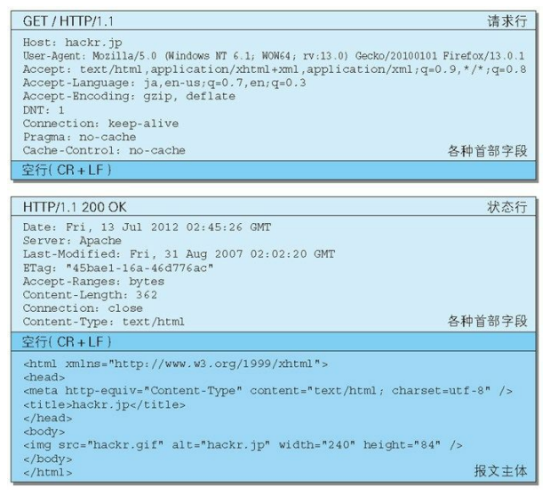
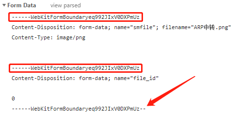
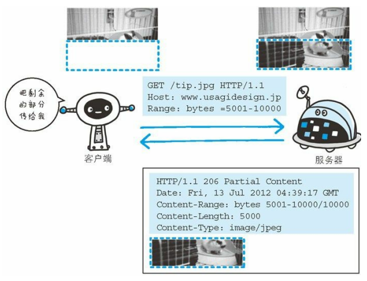

# HTTP 报文内的 HTTP 信息

## HTTP 报文

用于 HTTP 协议交互的信息被称为 HTTP 报文，客户端的 HTTP 报文叫做请求报文，服务器端的叫做响应报文

HTTP 报文本身是由多行（用 CR+LF 做换行符）数据构成的字符串文本

HTTP 报文 = 报文首部 + 空行 + 报文主体（通常不一定要有）

## 请求报文及响应报文的结构

- 请求报文
  - 报文首部
    - 请求行
    - 请求首部字段
    - 通用首部字段
    - 实体首部字段
    - 其他
  - 空行
  - 报文主体

- 响应报文
  - 报文首部
    - 状态行
    - 响应首部字段
    - 通用首部字段
    - 实体首部字段
    - 其他
  - 空行
  - 报文主体

请求行：包含用于请求的方法，请求 URI 和 HTTP 版本

状态行：包含表明响应结果的状态码，原因短语和 HTTP 版本

首部字段：包含表示请求和响应的各种条件和属性的各类首部，一般有 4 种首部，通用、请求、响应、实体首部

其他：可能包含 HTTP 的 RFC 里未定义的首部（Cookie 等）

## 编码提升传输速率

HTTP 在传输数据时可以按照数据原貌直接传输，但也可以在传输过程中编码提升传输速率

通过在传输时编码，能有效地处理大量的访问请求，但是会消耗更多的 CPU 等资源

### 报文主体和实体主体的差异

- 报文
  - 是 HTTP 通信中的基本单位，由 8 位组字节流（其中 octet 为 9 个比特）组成，通过 HTTP 通信传输
- 实体
  - 作为请求或响应的有效荷载数据（补充项）被传输，其内容由实体首部和实体主体组成

HTTP 报文的主体用于传输请求或响应的实体主体

通常，报文主体等于实体主体，只有当传输中进行编码操作时，实体主体的内容发生变化才会导致它和报文主体产生差异

### 压缩传输的内容编码

内容编码指明应用在实体内容上的编码格式，并保持实体信息原样压缩

内容编码后的实体由客户端接受并负责解码

常用的内容编码

- gzip（GNU zip）
- compress（UNIX 系统的标准压缩）
- deflate（zlib）
- identity（不进行编码）

### 分割发送的分块传输编码

在 HTTP 通信过程中，请求的编码实体资源尚未全部传输完成之前，浏览器无法显示请求页面

在传输大容量数据时，通过把数据分割成多块，能够让浏览器逐步显示页面

这种把实体主体分块的功能称为分块传输编码

## 发送多种数据的多部分对象集合

发送邮件时，我们可以在邮件里写入文字并添加多份附件

这是因为采用了 MIME（多用途因特网邮件扩展）机制，它允许邮件处理文本、图片、视频等多个不同类型的数据

例如，图片等二进制数据以 ASCII 码字符串编码的方式指明，就是利用 MIME 来描述标记数据类型

而在 MIME 扩展中会使用一种称为多部分对象集合的方法，来容纳多分不同类型的数据

相应地，HTTP 协议中也采纳了多部分对象集合，发送的一份报文主体内可含有多类型实体，通常在图片或文本文件等上传时使用

多部分对象集合包含的对象如下

- multipart/form-data
  - **在 Web 表单文件上传时使用**
- multipart/byteranges
  - 状态码 206（部分内容）响应报文包含了多个范围的内容时使用

在 HTTP 报文中使用多部分对象集合时，需要在首部字段里加上 Content-Type

## 获取部分内容的范围请求

为了解决下载过程中遇到网络中断的情况而导致重新下载的问题，需要断点下载

要实现该功能需要指定下载的实体范围，像这样指定范围发送的请求叫做范围请求

执行范围请求时，会用到首部字段 Range 来指定资源的 byte 范围

- 5001 ~ 10000 字节
  - Range: bytes=5001-10000
- 从 5001 字节后的全部
  - Range: bytes=5001-
- 从一开始到 3000 字节和 5000 ~ 7000 字节的多重范围
  - Range: bytes=-3000, 5000-7000

针对范围请求，响应会返回状态码为 206 的响应报文

另外，对于多重范围的范围请求，响应会在首部字段 Content-Type 表明 multipart/byteranges 后返回响应报文

如果服务器无法响应范围请求，则会返回状态码 200 OK 和完整的实体内容

## 内容协商返回最合适的内容

同一个网站可能存在多份相同内容的页面，当浏览器的默认语言为英文或中文，访问相同的 URI 的页面时，则会显示对应语言版本，遮掩的机制称为内容协商

内容协商机制是指客户端和服务端就响应的资源内容进行交涉，然后提供给客户端最为合适的资源

内容协商会以响应资源的语言、字符集、编码方式等作为判断的基准

- Accept
- Accept-Charset
- Accept-Encoding
- Accept-Language
- Content-Language

内容协商技术有以下 3 种类型

服务器驱动协商

由服务器进行内容协商，以请求的首部字段为参考，在服务端自动处理，但对用户来说，以浏览器发送的信息作为判定的依据并不一定能筛选出最优内容

客户端驱动协商

由客户端进行内容协商的方式，用户从页面上手动选择，还可以利用 JavaScript 脚本在页面上自动选择，比如根据浏览器窗口大小自动切换成 PC 版页面或手机版页面

透明协商

是服务器驱动和客户端驱动的结合体，是由服务器端和客户端各自进行内容协商的一种方式

# 返回结果的 HTTP 状态码

HTTP 状态码负责表示客户端 HTTP 请求的返回结果、标记服务器端的处理是否正常、通知出现的错误等工作

数字的第一位指定了相应类别，后两位无分类

|      | 类别                 | 原因短语                   |
| :--- | :------------------- | :------------------------- |
| 1XX  | 信息性状态码         | 接受的请求正在处理         |
| 2XX  | 成功状态码           | 请求正常处理完毕           |
| 3XX  | 重定向状态码         | 需要进行附加操作以完成请求 |
| 4XX  | **客户端错误状态码** | 服务器无法处理请求         |
| 5XX  | **服务器错误状态码** | 服务器处理请求错误         |

只要遵守状态码类别的定义，即使改变 RFC 定义的状态码或服务器端自行创建状态码都没问题

记录在 RFC 上的 HTTP 状态码就有 40 种，若再加上 WebDAV（基于万维网的分布式创作和版本控制）和附加 HTTP 状态码等扩展，数量就有 60 余种，记录常用的 14 个状态码

## 2XX 成功

2XX 的响应结果表明请求被正常处理了

### 200 OK

服务端：请求已正常处理

表示从客户端发来的请求在服务器端被正常处理了

### 204 No Content

服务端：请求处理成功，但没有资源可返回

表示服务器接受的请求已成功处理，但在返回的响应报文中不含实体的主体部分，另外也不允许返回任何实体的主体

比如，当从浏览器发出请求处理后，返回 204 响应，那么浏览器显示的页面不发生更新

一般只需要从客户端往服务端发送信息，而对客户端不需要发送新信息内容的情况下使用

### 206 Partial Content

服务端：请求处理成功，返回资源的某一部分

该状态码表示客户端进行了范围请求，而服务器成功执行了这部分的 GET 请求，响应报文中包含由 Content-Range 指定范围的实体内容

## 3XX 重定向

3XX 响应结果表明浏览器需要执行某些特殊的处理以正确处理请求

### 301 Moved Permanently

服务端：资源的 URI 已更新

永久性重定向。该状态码表示请求的资源已被分配了新的 URI，以后应使用资源现在所指的 URI

### 302 Found

服务端：资源的 URI 已临时定位到其他位置了

临时性重定向。该状态码表示请求的资源已被分配新的 URI，希望用户（本次）能使用新的 URI 访问

### 303 See Other

服务端：资源的 URI 已更新

该状态码表示由于请求对应的资源存在着另一个 URI，应使用 GET 方法定向获取请求的资源

303 和 302 的区别就在于 303 状态码明确表示客户端应当采用 GET 方法获取资源

> 比如，当使用 POST 方法访问 CGI 程序，器质性后的处理结果是希望客户端能以 GET 方法重定向到另一个 URI 上去时，返回 303 状态码是比较理想的

> 当 301、302、303 相应状态码返回时，几乎所有的浏览器都会把 POST 改成 GET，并删除请求报文内的主体，之后请求会自动再次发送

> 301、302 标准时禁止将 POST 方法改变成 GET 方法的，但实际使用时大家都会这么做

### 304 Not Modified

服务端：资源已找到，但未符合条件请求

该状态码表示客户端发送附带条件的请求时，服务端允许请求访问资源，但为满足条件的情况

304 状态码返回时，不包含任何相应的主体部分，虽然 304 被划分在 3XX 类别中，但是和重定向没有关系

附带条件的请求是指采用 GET 方法的请求报文中包含 If-Match、If-Modified-Since、If-None-Match、If-Range、If-Unmodified-Since 中任一首部

### 307 Temporary Redirect

临时重定向。和 302 由着相同的含义，尽管 302 标准禁止将 POST 变换成 GET，但实际大家并不遵守

307 会遵照浏览器标准，不会从 POST 变成 GET，但是对于处理响应时的行为，因浏览器而异

## 4XX 客户端错误

4XX 的响应结果表明客户端是发生错误的原因所在

### 400 Bad Request

服务端：我不能理解这个请求，是不是错了

该状态码表示请求报文中存在语法错误，当错误发生时，需修改请求的内容后再次发送请求

### 401 Unauthorized

该状态码表示发送的请求需要由通过 HTTP 认证（BASIC 认证、DIGEST 认证）的认证信息，另外若之前已进行过 1 次请求，则表示用户认证失败

返回含有 401 的响应必须包含一个适用于被请求资源的 WWW-Authenticate 首部用于质询用户信息，当浏览器初次接收到 401 响应会弹出认证用的对话窗口

### 403 Forbidden

服务端：不允许访问该资源

该状态码表明对请求资源的访问被服务器拒绝了，服务器没有必要给出拒绝的详细理由，但如果想作说明的话，可以在实体的主体部分对原因进行描述

### 404 Not Found

服务端：服务器上没有请求的资源

该状态码表明服务器上无法找到请求的资源，除此之外，也可以在服务器端拒绝请求且不想说明理由时使用

## 5XX 服务器错误

5XX 的响应结果表明服务器本身发生错误

### 500 Internal Server Error

服务端：内部资源出故障了

该状态码表明服务器端在执行请求时发生了错误，也有可能是 Web 应用存在的 bug 或某些临时的故障

### 503 Service Unavailable

服务端：我现在正忙

该状态码表明服务端暂时处于超负载或正在进行停机维护，现在无法处理请求，如果事先得知解除以上状况需要的时间，最好写入 RetryAfter 首部字段再返回给客户端

> 状态码和状态的不一致
> 不少返回的状态码响应都是错误的，但是用户可能察觉不到这点，比如 Web 应用程序内部发生错误，状态码依然返回 200 OK
