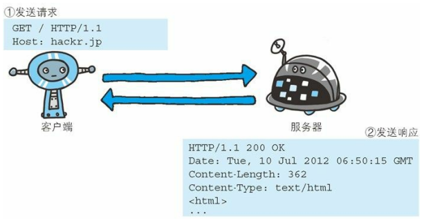
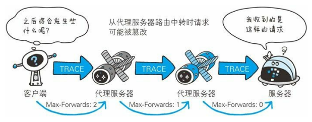
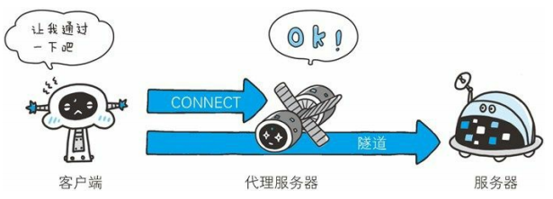
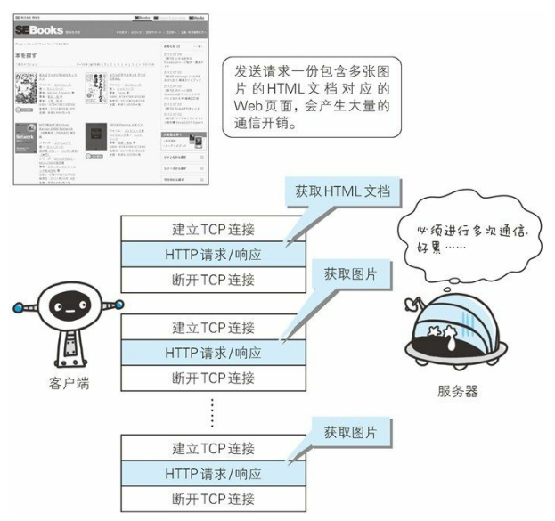
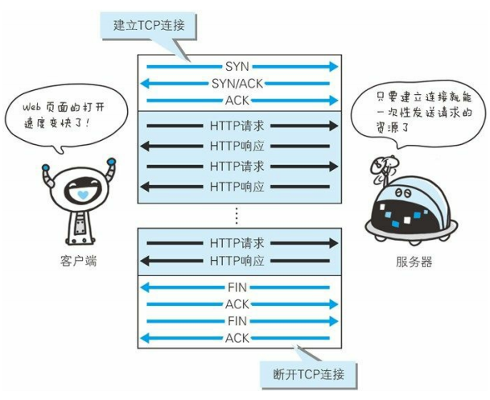

# 简单的 HTTP 协议

## HTTP 协议用于客户端和服务器端之间的通信

两台计算机作为客户端和服务端的角色有可能会互换，但就仅从一条通信路线来说，角色是确定的，而用 HTTP 协议能够明确区分两端

## 通过请求和响应的交换达成通信

请求必定由客户端发出，而服务器端回复响应

HTTP 协议规定，请求从客户端发出，最后服务端响应该请求并返回，换句话说，客户端是主动端，服务端是被动端



```
GET /index.html HTTP/1.1
Host: github.com
```

请求报文其实行开头的 GET 表示请求访问服务器的类型，随后的字符串 /index.html 指明了请求访问的资源对象，也就做请求 URI，最后的 HTTP/1.1 表示 HTTP 的版本号

请求报文是由请求方法、请求 URI、协议版本、可选的请求首部字段和内容实体构成的

```
POST /from/entry HTTP/1.1
Host: github.com
Connection: keep-alive
Content-Type: appliccation/x-www-form-urlencoded
Content-Length: 16

name=github&age=10
```

- POST 方法
- /form/entry URI
- HTTP/1.1 协议版本
- HOST...Content-Length 请求首部字段
- name...age 内容实体

服务器接收到请求之后会将请求内容的处理结果以相应的形式返回

响应报文基本上由协议版本、状态码（表示请求成功或失败的数字代码）、用于解释状态码的原因短语、可选的响应首部字段以及实体主体构成

```
HTTP/1.1 200 OK
Date: ...
Content-Length: 362
Content-Type: text/html

<hmtl>
...
</html>
```

- HTTP/1.1 表示服务器对应的 HTTP 版本
- 200 OK 表示请求的处理结果状态码（200）和原因字段（OK）
- Date 表示创建响应的日期时间
- Date...Content-Type 响应首部字段
- \<html\>...\<\/html\> 主体

## HTTP 是不保存状态的协议

HTTP 是无状态协议，HTTP 协议自身不对请求和响应之间的通信状态进行保存

也就是说在 HTTP 这个级别，协议对于发送过的请求或相应都不做持久化处理

使用 HTTP 协议，每当有新的请求发送时，就会有对应的新响应产生，协议本身并不保留之前一切的请求或响应报文的信息，这是为了更快处理大量事务

为了保存用户的登陆状态，引入了 Cookie 技术，有了 Cookie 再用 HTTP 协议通信，就可以管理状态了

## 请求 URI 定位资源

除此之外，如果不是访问特定资源而是对服务器本身发起请求，可以用一个 \* 来代替请求 URI

```
OPTIONS * HTTP/1.1
```

## 告知服务器意图的 HTTP 方法

- GET
  - 用来请求访问已被 URI 识别的资源，制定的资源经服务器端解析后返回响应内容
  - 也就是说如果请求的资源是文本，那就保持原样返回
  - 如果是像 CGI（通用网关接口）那样的程序，则返回经过执行后的输出结果

```
GET /index.html HTTP/1.1
Host: www.github.com
```

↓↓↓

```
返回 index.html 的页面资源
```

```
GET /index.html HTTP/1.1
Host: www.github.com
If-Modified-Since: ...
```

↓↓↓

```
仅返回 If-Modified-Since 之后的事件更新过的 index.html 页面资源，如果未有内容更新，则以状态码 304 Not Modified 作为状态码返回
```

- POST
  - 用来传输实体的主体
  - 虽然用 GET 也可以传输实体的主体，但一般不用 GET 方法进行传输，而是用 POST
  - 虽说 POST 和 GET 很相似，但 POST 的主要目的并不是获取响应的主体内容

```
POST /submit HTTP/1.1
Host: www.github.com
Content-Length: 1024（1024字节的数据）
```

↓↓↓

```
返回 submit 接收数据的处理结果
```

- PUT
  - 用来传输文件，就像 FTP 协议的文件上传一样
  - 要求在请求报文的主体中包含文件内容
  - 然后保存到请求 URI 制定的位置

> 但是鉴于 HTTP/1.1 的 PUT 方法自身不带验证机制，任何人都可以上传文件，存在安全性问题，因此一般不使用该方法，若配合 Web 应用程序的验证机制，或架构设计采用 REST（表征状态转移）标准的同类 Web 网站，就可能会开放使用 PUT 方法

```
PUT /example.html HTTP/1.1
Host: www.github.com
Content-Type: text/html
Content-Length: 1024（1024字节的数据）
```

↓↓↓

```
响应返回状态码为 204 No Content（比如：该 html 已存在与服务器上）
```

- HEAD
  - 和 GET 方法类似，只是不返回报文主体部分
  - 用于确认 URI 的有效性及资源更新的日期时间等

```
HEAD /index.html HTTP/1.1
Host: www.github.com
```

↓↓↓

```
返回 index.html 有关的响应首部
```

- DELETE
  - 用来删除文件，与 PUT 相反的方法

```
DELETE /example.html HTTP/1.1
Host: www.github.com
```

↓↓↓

```
响应返回状态码 204 No Content（比如：该 html 已从该服务器上删除）
```

- OPTIONS
  - 询问支持的方法
  - 用来查询针对请求 URI 制定的资源支持的方法

```
OPTIONS * HTTP/1.1
Host: www.github.com
```

↓↓↓

```
HTTP/1.1 200 OK
Allow: GET,POST,HEAD,OPTIONS（返回服务器支持的方法）
```

- TRACE
  - 让服务端将之前的请求通信环回给客户端的方法
  - 发送请求时，在 Max-Forwards 首部字段中填入数值，每经过一个服务端就把该数字减 1
  - 当数值刚好减到 0 时，就停止继续传输，最后接收到请求的服务端则返回状态码 200 OK 的响应
  - 客户端通过 TRACE 方法可以查询发送出去的请求是怎样被加工修改/篡改的
  - 这是因为请求想要连接到源目标服务器可能会通过代理中转
  - TRACE 方法就是用来确认连接过程中发生的一系列操作
  - 但是，这个方法本来就不怎么常用，再容易引发 XST（跨域追踪）攻击，就更不会用到了



```
TRACE / HTTP/1.1
Host: www.github.com
Max-Forwards: 2
```

↓↓↓

```
HTTP/1.1 200 OK
Content-Type: message/http
Content-Length: 1024

TRACE / HTTP/1.1
host: www.github.com
Max-Forwards: 2（返回响应包含请求内容）
```

- CONNECT
  - 要求用隧道协议连接代理
  - 该方法要求在与代理服务器通信时建立隧道，实现用隧道协议进行 TCP 通信
  - 主要使用 SSL（安全套接层）和 TLS（传输层安全）协议把通信内容加密后经网络隧道传输



```
CONNECT proxy.github.com:8080 HTTP/1.1
Host: proxy.github.com
```

↓↓↓

```
HTTP/1.1 200 OK（之后进入网络隧道）
```

## 使用方法下达命令

| 方法    |          说明          |
| :------ | :--------------------: |
| GET     |        获取资源        |
| POST    |      传输实体主体      |
| PUT     |        传输文件        |
| HEAD    |      获得报文首部      |
| DELETE  |        删除文件        |
| OPTIONS |     询问支持的方法     |
| TRACE   |        追踪路径        |
| CONNECT | 要求用隧道协议连接代理 |

## 持久连接节省通信量



### 持久连接

为了解决上述 TCP 连接的问题，HTTP/1.1 和一部分的 HTTP/1.0 想出了持久连接（也称为 HTTP keep-alive 或 HTTP connention reuse）的方法

持久连接的特点是，只要任意一端没有明确提出断开连接，则保持 TCP 连接状态



持久连接的好处在于减少了 TCP 连接的重复建立和断开所造成的额外开销，减轻了服务器端的负载

另外，减少开销的那部分时间，使 HTTP 请求和相应能够能早地结束，这样 Web 页面的显示速度就提高了

在 HTTP/1.1 中，所有的连接默认都是持久连接

### 管线化

从前发送请求后需等待并收到响应才能发送下一个请求

管线化出现后，不用等待响应亦可直接发送下一个请求

当请求一个包含 10 张图片的页面，与挨个连接相比，用持久连接可以让请求更快结束，而管线化技术则比持久连接还要快

## 使用 Cookie 的状态管理

HTTP 是无状态协议，服务端不需要记住所有的客户端信息，但是又要解决登录状态的问题，于是就引入了 Cookie 技术

Cookie 技术通过在请求和响应报文中写入 Cookie 信息来控制客户端的状态

Cookie 会根据从服务端发送的响应报文内的一个叫做 **Set-Cookie** 的首部字段信息，通知客户端保存 Cookie

当下次客户端再往该服务器发送请求时，客户端会自动在请求报文中加入 Cookie 值后发送出去

服务端发现客户端发送过来的 Cookie 后，会去查看是哪个客户端发来的请求，然后对比服务器上的记录，最后得到之前的状态信息

客户端 ---> 请求（一般是登陆的请求） ---> 服务器

客户端（保存 Cookie） <--- 响应（加入 Cookie） <--- 服务器

客户端 ---> 请求（携带 Cookie） ---> 服务器

客户端 <--- 响应（携带 Cookie） <--- 服务器

```
GET /login HTTP/1.1
host: www.github.com
```

↓↓↓

```
HTTP/1.1 200 OK
Date: ...
Server: Apache
<Set-Cookie: sid=123456123345; path=/; expires=...>
Content-Type: text/plain; charset=UTF-8
```

↓↓↓

```
GET /getSome HTTP/1.1
Host: www.github.com
Cookie: sid=123456123345
```