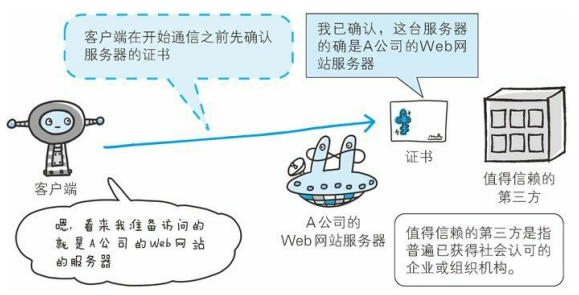
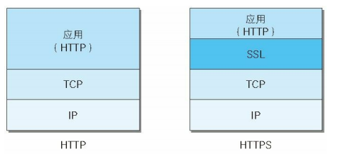
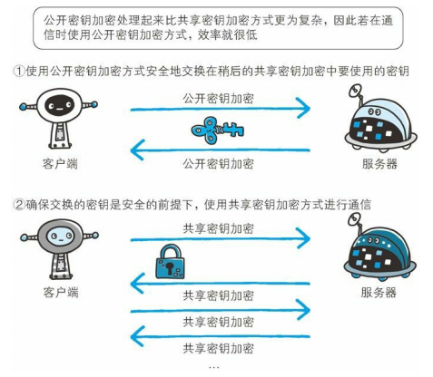
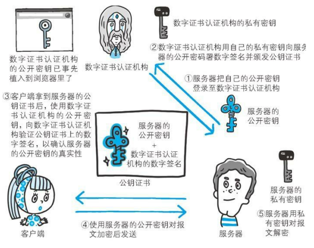
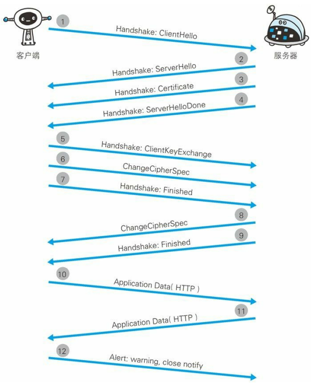
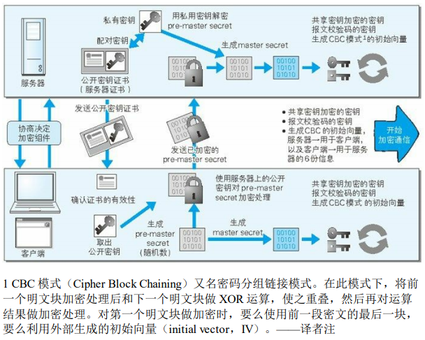
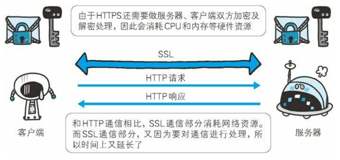

# 确保 Web 安全的 HTTPS

在 HTTP 协议中有可能存在信息窃听或身份伪装等安全问题，使用 HTTPS 通信机制可以有效地防止这些问题

## HTTP 的缺点

- 通信使用明文（不加密），内容可能会被窃听
- 不验证通信方的身份，因此有可能遭遇伪装
- 无法证明报文的完整性，所以有可能已遭篡改
- ...

### 通信使用明文可能会被窃听

#### 加密处理防止被窃听

##### 通信的加密

HTTP 协议中没有加密机制，但可以通过和 SSL（安全套接层）或 TLS（安全层传输协议）的组合使用，加密 HTTP 的通信内容

用 SSL 建立安全通信线路之后，就可以在这条线路上进行 HTTP 通信了，与 SSL 组合使用的 HTTP 被称为 HTTPS（超文本传输安全协议）或 HTTP over SSL

##### 内容的加密

客户端需要对 HTTP 报文进行加密处理后再发送请求，由于该方式不同于 SSL 或 TLS 将整个通信线路加密处理，所以内容仍有被篡改的风险

### 不验证通信方的身份就可能遭遇伪装

HTTP 协议中的请求和响应不会对通信放进行确认

也就是说，客户端请求的 URI 是否是 URI 中真正指定的主机，服务端返回的响应是否真的返回到实际提出需求的客户端

#### 任何人都可发起请求

服务器只要接收到请求，不管对方是谁都会返回一个响应（但也仅限于发送端的 IP 地址和端口号没有被 Web 服务器限制访问）

#### 查明对手的证书

### 无法证明报文完整性，可能已造篡改

#### 接收到的内容可能有误

## HTTP + 加密 + 认证 + 完整性保护 = HTTPS

### HTTPS 是身披 SSL 外壳的 HTTP

HTTPS 并非是应用层的一种新协议，只是 HTTP 通信接口部分用 SSL 和 TLS 协议代替

通常，HTTP 和 TCP 直接通信，当使用 SSL 时，则演变成先和 SSL 通信，再由 SSL 和 TCP 通信

SSL 是独立于 HTTP 的协议，所以不光是 HTTP 协议，其他运行在应用层的 SMTP 和 Telnet 等协议均可配合 SSL 协议使用

### SSL 的加密处理方式

SSL 采用一种公开密钥加密的加密处理方式

近代的加密方法中，加密算法是公开的，而密钥却是保密的，通过这种方式得以保持加密方法的安全性

- 共享密钥加密的困境

加密和解密同用一个密钥的方式被称为共享密钥加密，也叫做对称密钥加密

以共享密钥方式加密时必须将密钥也发给对方，可如何才能安全的转交呢？在互联网上转发密钥时，如果通信被监听了，那密钥就落入攻击者之手，同时也失去了加密的意义

- 使用两把密钥的公开密钥加密

公开密钥加密方式很好地解决了共享密钥加密的困难

公开密钥加密使用一对非对称的密钥，一把叫做私有密钥，另一把叫做公开密钥

使用公开密钥加密方式，发送密文的一方使用对方的公开密钥进行加密处理，对方收到被加密的信息后，再使用自己的私有密钥进行解密，这种方式不需要发送用来解密的私有密钥

- HTTPS 采用混合加密机制

HTTPS 采用共享密钥加密和公开密钥加密两者并用的混合加密机制，若密钥能够实现安全交换，那就会考虑仅用公开密钥加密来通信，但是公开密钥加密与共享密钥加密相比处理速度要慢

如果在交换密钥环节使用公开密钥加密方式，建立通信交换报文阶段则使用共享密钥加密方式

### 证明公开密钥正确性的证书

公开密钥加密方式还是存在一些问题，那就是无法证明公开密钥本身就是货真价实的公开密钥

为了解决问题，可以使用由数字证书认证机构（CA）和其相关机关颁发的公开密钥证书

- 可证明组织真实性的 EV SSL 证书
- 用以确认客户端的客户端证书
- 认证机构信誉第一
- 由自认证机构颁发的证书称为自签名证书

### HTTPS 的安全通信机制

1. 客户端通过发送 Client Hello 报文开始 SSL 通信，报文中包含客户端支持的 SSL 的指定版本、加密组件列表
2. 服务器可进行 SSL 通信时，会以 Server Hello 报文作为应答，和客户端一样，在报文中包含 SSL 版本以及加密组件，服务器的加密组件内容是从接收到的客户端加密组件内筛选出来的
3. 之后服务器发送 Certificate 报文，报文中包含公开密钥证书
4. 最后服务器发送 Server Hello Done 报文通知客户端，最初阶段的 SSL 握手协商部分结束
5. SSL 第一次握手结束之后，客户端以 Client Key Exchange 报文作为回应，报文中包含通信加密中使用的一种被称为 Pre-master secret 的随机密码串，该报文已使用步骤 3 中的公开密钥进行加密
6. 结者客户端继续发送 Change Cipher Spec 报文，该报文会提示服务器，再次报文之后的通信会采用 Pre-master secret 密钥加密
7. 客户端发送 Finished 报文，该报文包含连接至今全部报文的整体校验值，这次握手协商是否能够成功，要以服务器是否能够正确解密该报文作为判定标准
8. 服务器同样发送 Change Cipher Spes 报文
9. 服务器同样发送 Finished 报文
10. 服务器和客户端的 Finished 报文交换完毕之后，SSL 链接就算建立完成，当然，通信会受到 SSL 的保护，从此处开始进行应用层协议的通信，即发送 HTTP 请求
11. 应用层协议通信，即发送 HTTP 响应
12. 最后由客户端断开连接，断开连接时，发送 close_notify 报文，这步之后再发送 TCP FIN 报文来关闭与 TCP 的通信

在以上流程中，应用层发送数据时会附加一种叫做 MAC 的报文摘要，MAC 能够查知报文是否遭到篡改，从而保护报文的完整性

#### SSL 和 TLS

HTTPS 使用 SSL 和 TLS 这两个协议

SSL 技术最初是由浏览器开发商网景通信公司倡导的，目前主导权已转移到 IETF（Internet 工程任务组）的手中

IETF 以 SSL3.0 为基准，后又制定了 TLS1.0、TLS1.1 和 TLS1.2，TSL 是以 SSL 为原型开发的协议，有时会统一称该协议为 SSL，当前主流版本是 SSL3.0 和 TLS1.0

#### SSL 速度慢么

SSL 的慢分两种，一种是指通信慢，另一种是指由于大量消耗 CPU 及内存等资源，导致处理速度变慢

和使用 HTTP 相比，网络负载可能会变慢 2 到 100 倍，出去和 TCP 连接、发送 HTTP 请求/响应以外，还必须进行 SSL 通信，因此整体上处理信息量不可避免会增加

另一点是 SSL 必须进行加密处理，在服务器上和客户端都需要进行加密和解密的运算处理，因此从结果上讲，比起 HTTP 会更多地消耗服务器和客户端的硬件资源，导致负载增强

#### 为什么不一直使用 HTTPS

- 加密消耗更多的 CPU 及内存资源，平摊到一台计算机上时，能够处理的请求数量会随之减少
- 想要节约购买证书的开销
