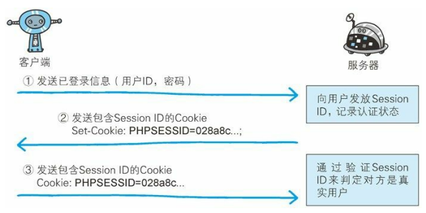

# 确认访问用户身份的认证

HTTP/1.1 使用的认证方式如下

- BASIC 认证（基本认证）
- DIGEST 认证（摘要认证）
- SSL 客户端认证
- FormBase 认证（基于表单认证）

### Session 管理及 Cookie 应用

基于表单认证本身是通过服务器端的 Web 应用，将客户端发送过来的用户 ID 和密码与之前登陆过的信息做匹配来进行认证的

但鉴于 HTTP 是无状态协议，之前已认证成功的用户状态无法通过协议层面而保存下来，即，无法实现状态管理

我们就会使用 Cookie 来管理 Session，以弥补 HTTP 协议中不存在的状态管理功能

1. 客户端把用户 ID 和密码等登陆信息放入报文的实体部分，通常用 POST 方法把请求发送给服务器，而这时一般会采用 HTTPS 通信
2. 服务器会发放用以标识用户的 Session ID，若客户端发送过来的登陆信息被确认，把用户的认证状态与 Session ID 绑定后记录再服务器端
   1. 向客户端返回响应式，会在首部字段 Set-Cookie 内写入 Session ID（如：USERID=123）
   2. 然而，如果 Session ID 被第三方盗走，对方就可以伪装身份进行恶意操作了，因此必须防止 Session ID 被盗
   3. 另外，为减轻（XSS）造成的损失，建议在 Cookie 内加上 HttpOnly
3. 客户端接收到从服务器端发来的 Session ID 后，会将其作为 Cookie 保存在本地，下次发送请求时浏览器会自动发送 Cookie，所以 Session ID 也会随之发送到服务器，服务器可以通过验证 Session ID 来识别用户和其认证状态
